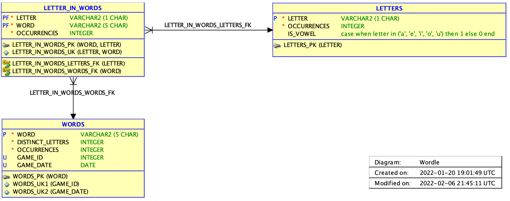

# Wordle Helper

## Introduction

This is an implementation of [Josh Wardle](https://github.com/powerlanguage)'s [Wordle](https://www.powerlanguage.co.uk/wordle/) in the Oracle Database using SQL and PL/SQL. This solution uses the same data. Starting with game #0 on 2021-06-19 on a daily basis. 

You can play past, current or future games. The solution is implemented with a set of table functions. The table function `wordle.play` helps guessing and visualizes the results. The table function `wordle.autoplay` plays a game automatically for you. It uses the first suggestion until it finds a solution. Sometimes it takes more than the forseen 6 guesses. It's like in real life.

I have to admit that I used [Word Finder](https://wordfinder.yourdictionary.com/) to solve the daily Wordles. I'm really bad in querying 5-letter words in my head. This web site allows to filter words by the number of letters and one or more starting and ending letters. You can use also some wildcards to formulate additional search criteria. It helped me to find fitting words for Wordle and learn the meaning of various words I never heard of.

As a database fanboy I wanted to query possible candidates via SQL, to more efficently reduce the solution space with every guess. And I've seen that [Filipe Hoffa](https://twitter.com/felipehoffa/status/1482148680798904321) and [Connor McDonald](https://twitter.com/connor_mc_d/status/1484076351087058946) not only tweeted about Wordle, but also made some progress with their database driven Wordle approaches. So, I decided to give it a try.

## Prerequisites

* Oracle Datbase 19c or higher
* Oracle SQLcl for ANSI console output variant
* Any SQL client should be fine for the ASCII output variant

## Installation

1. Create a user in the Oracle Database. No special rights. `connect` and `resource` is enough. I named the user `wordle`. But you can choose whatever you want.

2. Clone or download this GitHub repsitory.

3. Open a terminal window and change to the directory containing this README.md file

    ```
    cd (...)
    ```

4. Connect to the database and execute this script (I've used it sucessfully with SQLcl und SQL Developer):

    ```sql
    @install.sql
    ```  

## Model

The installation scripts creates and populates this database model:



The main table is `WORDS`. It contains `12972` accepted words. `2315` of these words are used as solutions. They have an assosciated `GAME_NUMBER` and `GAME_ON` date. As a result they are used only once. The last Wordle game #2314 is scheduled for 2027-10-20.

## Semantic

## ANSI Console


To do this, you must use `set linesize 250` (or higher) because the ANSI escape sequences inflate the result column. If you reduce the line size the result may be wrapped or truncated depending on your settings.

The colors are similar to those used in Wordle. They should therefore be self-explanatory.

## ASCII (Plain)


This works in any SQL client and is therefore the default. The next table should make the semantic clear.

ASCII | ANSI | Notes / Mnemonics
-- | -- | --
.T. | | Dots mean the letter is at the right position. The dots are like anchors on both sides, making the result final.
(N) |  | Parenthesis mean the right letter but at the wrong position. 
-U- |  | Dashes mean the letter is not used (also when there are too many occurrences of a letter). It's similar to the syntax used  in some Wikis to cross out words.


## Single Guess via Table Function `wordle.play`

### Example

The idea is to call this function per guess. The following call:

```sql
select * from wordle.play(209, 'noise');
```

produces this result:

```
Result Sequence
----------------------------------------------------------------------------------------------------
(N) -O- -I- -S- -E-

with
   other_letters as (
      select w.word
        from words w
        join char_in_words cw
          on cw.word = w.word
        join chars c
          on c.character = cw.character
       where cw.character not in ('e','i','n','o','s')
       group by w.word
      having count(*) >= 4
       order by count(*) desc, sum(c.is_vowel) desc, sum(c.occurrences) desc, w.word
       fetch first 1 row only
   ),
   hard_mode as (
      select word
        from words
       where word like '_____'
         and instr(word, 'n', 1, 1) > 0
         and word not like 'n____'
         and word not like '%e%'
         and word not like '%i%'
         and word not like '%o%'
         and word not like '%s%'
         and word not in ('noise')
       order by case when game_number is not null then 0 else 1 end, word
       fetch first 10 rows only
   ),
   all_matcher as (
      select word
        from other_letters 
        union all 
      select word
        from hard_mode
   )
select word 
  from all_matcher
 fetch first 10 rows only

ultra
angry
annul
aunty
banal
bland
blank
blunt
brand
brawn

12 rows selected. 
```

In the first part the guess is evaluated. `(N) -O- -I- -S- -E-` is shown.

In the second part the guesses are used to produce a query for suggestions. In this example a query in normal mode is shown. That's the default. You can call `exec wordle.set_hard_mode(true);` to reuse known letters. 

In the third part some suggestions are shown. `10` is the default. You may change that by calling `exec wordle.set_suggestions(...);`. Another option is to copy und paste the query and run it.

### Signatures

Here are the relevant signaturs of the PL/SQL package `wordle` for the `play` functions.

```sql
   function play(
      in_game_number in words.game_number%type,
      in_words       in word_ct,
      in_autoplay    in integer default 0
   ) return word_ct;

   function play(
      in_game_number in words.game_number%type,
      in_word1       in words.word%type,
      in_word2       in words.word%type default null,
      in_word3       in words.word%type default null,
      in_word4       in words.word%type default null,
      in_word5       in words.word%type default null,
      in_word6       in words.word%type default null
   ) return word_ct;
   
   function play(
      in_word1 in words.word%type,
      in_word2 in words.word%type default null,
      in_word3 in words.word%type default null,
      in_word4 in words.word%type default null,
      in_word5 in words.word%type default null,
      in_word6 in words.word%type default null
   ) return word_ct;
```

`word_ct` is a collection type which is defined as `table of varchar2(1000 char)`. The second and third signature are provided for convenience.

If you do not pass a `in_game_number` then the game number is determined according the ccurrent date (`sysdate`).

## Autonomous Guesses via Table Function `wordle.autoplay`

### Example

The idea is to set a starting point and let the machine do the guessing. The following call:

```sql
select * from wordle.autoplay(209);
```

produces this result:

```
Result Sequence
----------------------------------------------------------------------------------------------------

with
   other_letters as (
      select w.word
        from words w
        join char_in_words cw
          on cw.word = w.word
        join chars c
          on c.character = cw.character
       group by w.word
      having count(*) >= 4
       order by count(*) desc, sum(c.is_vowel) desc, sum(c.occurrences) desc, w.word
       fetch first 1 row only
   ),
   hard_mode as (
      select word
        from words
       where word like '_____'
       order by case when game_number is not null then 0 else 1 end, word
       fetch first 10 rows only
   ),
   all_matcher as (
      select word
        from other_letters 
        union all 
      select word
        from hard_mode
   )
select word 
  from all_matcher
 fetch first 10 rows only

aurei
aback
abase
abate
abbey
abbot
abhor
abide
abled
abode

autoplay added: aurei (1)

(A) -U- -R- -E- -I-

with
   other_letters as (
      select w.word
        from words w
        join char_in_words cw
          on cw.word = w.word
        join chars c
          on c.character = cw.character
       where cw.character not in ('a','e','i','r','u')
       group by w.word
      having count(*) >= 4
       order by count(*) desc, sum(c.is_vowel) desc, sum(c.occurrences) desc, w.word
       fetch first 1 row only
   ),
   hard_mode as (
      select word
        from words
       where word like '_____'
         and instr(word, 'a', 1, 1) > 0
         and word not like 'a____'
         and word not like '%e%'
         and word not like '%i%'
         and word not like '%r%'
         and word not like '%u%'
         and word not in ('aurei')
       order by case when game_number is not null then 0 else 1 end, word
       fetch first 10 rows only
   ),
   all_matcher as (
      select word
        from other_letters 
        union all 
      select word
        from hard_mode
   )
select word 
  from all_matcher
 fetch first 10 rows only

stoln
bacon
badly
baggy
balmy
banal
banjo
basal
batch
baton

autoplay added: stoln (2)

(A) -U- -R- -E- -I-
-S- (T) -O- -L- (N)

with
   other_letters as (
      select w.word
        from words w
        join char_in_words cw
          on cw.word = w.word
        join chars c
          on c.character = cw.character
       where cw.character not in ('a','e','i','l','n','o','r','s','t','u')
       group by w.word
      having count(*) >= 4
       order by count(*) desc, sum(c.is_vowel) desc, sum(c.occurrences) desc, w.word
       fetch first 1 row only
   ),
   hard_mode as (
      select word
        from words
       where word like '_____'
         and instr(word, 'a', 1, 1) > 0
         and word not like 'a____'
         and instr(word, 'n', 1, 1) > 0
         and word not like '____n'
         and instr(word, 't', 1, 1) > 0
         and word not like '_t___'
         and word not like '%e%'
         and word not like '%i%'
         and word not like '%l%'
         and word not like '%o%'
         and word not like '%r%'
         and word not like '%s%'
         and word not like '%u%'
         and word not in ('aurei', 'stoln')
       order by case when game_number is not null then 0 else 1 end, word
       fetch first 10 rows only
   ),
   all_matcher as (
      select word
        from other_letters 
        union all 
      select word
        from hard_mode
   )
select word 
  from all_matcher
 fetch first 10 rows only

dampy
chant
tangy
tawny
thank
twang
banty
canty
daynt
janty

autoplay added: dampy (3)

(A) -U- -R- -E- -I-
-S- (T) -O- -L- (N)
-D- .A. -M- -P- .Y.

with
   other_letters as (
      select w.word
        from words w
        join char_in_words cw
          on cw.word = w.word
        join chars c
          on c.character = cw.character
       where cw.character not in ('a','d','e','i','l','m','n','o','p','r','s','t','u','y')
       group by w.word
      having count(*) >= 4
       order by count(*) desc, sum(c.is_vowel) desc, sum(c.occurrences) desc, w.word
       fetch first 1 row only
   ),
   hard_mode as (
      select word
        from words
       where word like '_a__y'
         and instr(word, 'a', 1, 1) > 0
         and word not like 'a____'
         and instr(word, 'n', 1, 1) > 0
         and word not like '____n'
         and instr(word, 't', 1, 1) > 0
         and word not like '_t___'
         and word not like '%d%'
         and word not like '%e%'
         and word not like '%i%'
         and word not like '%l%'
         and word not like '%m%'
         and word not like '%o%'
         and word not like '%p%'
         and word not like '%r%'
         and word not like '%s%'
         and word not like '%u%'
         and word not in ('aurei', 'stoln', 'dampy')
       order by case when game_number is not null then 0 else 1 end, word
       fetch first 10 rows only
   ),
   all_matcher as (
      select word
        from other_letters 
        union all 
      select word
        from hard_mode
   )
select word 
  from all_matcher
 fetch first 10 rows only

chawk
tangy
tawny
banty
canty
janty
natty
tanky
tanty
wanty

autoplay added: chawk (4)

(A) -U- -R- -E- -I-
-S- (T) -O- -L- (N)
-D- .A. -M- -P- .Y.
-C- -H- (A) -W- -K-

with
   hard_mode as (
      select word
        from words
       where word like '_a__y'
         and instr(word, 'a', 1, 1) > 0
         and word not like 'a____'
         and word not like '__a__'
         and instr(word, 'n', 1, 1) > 0
         and word not like '____n'
         and instr(word, 't', 1, 1) > 0
         and word not like '_t___'
         and word not like '%c%'
         and word not like '%d%'
         and word not like '%e%'
         and word not like '%h%'
         and word not like '%i%'
         and word not like '%k%'
         and word not like '%l%'
         and word not like '%m%'
         and word not like '%o%'
         and word not like '%p%'
         and word not like '%r%'
         and word not like '%s%'
         and word not like '%u%'
         and word not like '%w%'
         and word not in ('aurei', 'stoln', 'dampy', 'chawk')
       order by case when game_number is not null then 0 else 1 end, word
   )
select word 
  from hard_mode
 fetch first 10 rows only

tangy
banty
janty
natty
tanty

autoplay added: tangy (5)

(A) -U- -R- -E- -I-
-S- (T) -O- -L- (N)
-D- .A. -M- -P- .Y.
-C- -H- (A) -W- -K-
.T. .A. .N. .G. .Y.

Bravo! You completed Wordle 209 5/6

82 rows selected.
```

In this case no guess was used as starting point. This works. `autoplay` always chooses the first suggestion, also for the very first guess. This process is repeated until a solution is found. It does not matter how many guesses are necessary. In 99.3 percent of the cases a solution is found within 6 guesses in normal mode (94.7 percent in hard mode).

### Signatures

Here are the relevant signaturs of the PL/SQL package `wordle` for the `autoplay` functions.

```sql
   function play(
      in_game_number in words.game_number%type,
      in_words       in word_ct,
      in_autoplay    in integer default 0
   ) return word_ct;

   function autoplay(
      in_game_number in words.game_number%type,
      in_word1       in words.word%type default null,
      in_word2       in words.word%type default null,
      in_word3       in words.word%type default null,
      in_word4       in words.word%type default null,
      in_word5       in words.word%type default null,
      in_word6       in words.word%type default null
   ) return word_ct;

   function autoplay(
      in_word1       in words.word%type default null,
      in_word2       in words.word%type default null,
      in_word3       in words.word%type default null,
      in_word4       in words.word%type default null,
      in_word5       in words.word%type default null,
      in_word6       in words.word%type default null
   ) return word_ct;
```

The functions are basically identical to the other `play` functions. The only difference is that the `in_autoplay` parameter is set to `1` (true).
